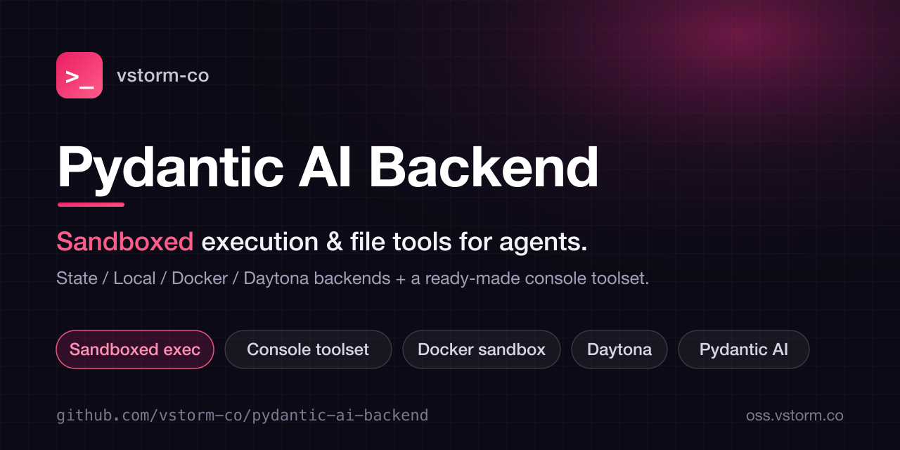
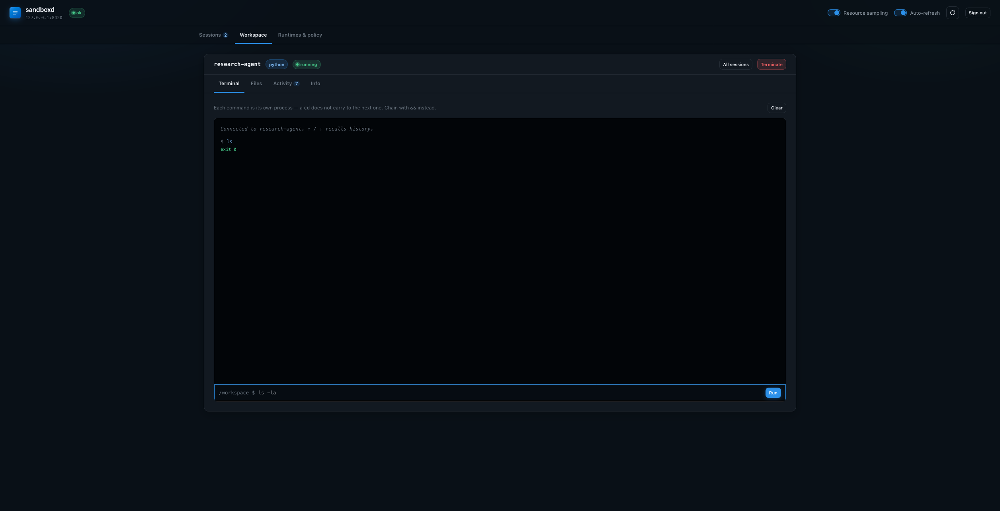
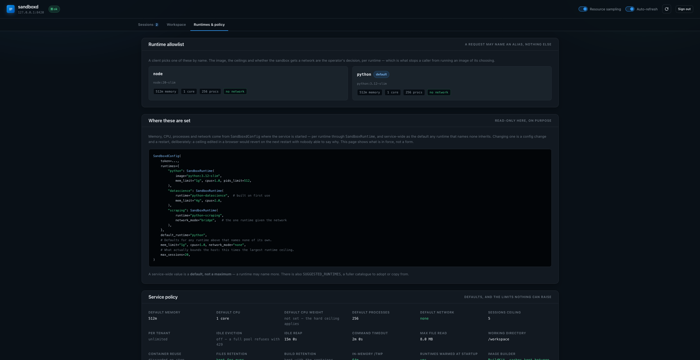

<p align="center">
  
</p>

<h1 align="center">Pydantic AI Backend</h1>

<p align="center">
  <b>Sandboxed execution & file tools for agents.</b><br>
  A ready-made console toolset over State / Local / Docker / Daytona backends,<br>
  plus a sandbox service so your app never needs Docker access.
</p>

<p align="center">
  <a href="https://vstorm-co.github.io/pydantic-ai-backend/">Docs</a> &middot;
  <a href="https://pypi.org/project/pydantic-ai-backend/">PyPI</a> &middot;
  <a href="#installation">Install</a> &middot;
  <a href="#vstorm-oss-ecosystem">Ecosystem</a> &middot;
  <a href="https://github.com/vstorm-co/pydantic-deepagents">Deep Agents</a>
</p>

<p align="center">
  <a href="https://pypi.org/project/pydantic-ai-backend/"></a>
  <a href="https://pepy.tech/projects/pydantic-ai-backend"></a>
  <a href="https://github.com/vstorm-co/pydantic-ai-backend/stargazers"></a>
  <a href="https://www.python.org/downloads/"></a>
  <a href="https://opensource.org/licenses/MIT"></a>
  <a href="https://coveralls.io/github/vstorm-co/pydantic-ai-backend?branch=main"></a>
  <a href="https://github.com/vstorm-co/pydantic-ai-backend/actions/workflows/ci.yml"></a>
  <a href="https://github.com/pydantic/pydantic-ai"></a>
</p>

<p align="center">
  <b>Console toolset</b> &nbsp;&bull;&nbsp; <b>State / Local / Docker / Daytona / Remote</b> &nbsp;&bull;&nbsp; <b>Permission system</b> &nbsp;&bull;&nbsp; <b>Session manager</b> &nbsp;&bull;&nbsp; <b>No docker-in-docker</b>
</p>

---

> **Part of [Pydantic Deep Agents](https://github.com/vstorm-co/pydantic-deepagents)** — the open-source Claude Code alternative & Python agent framework. Use this library standalone, or get everything wired together in one `create_deep_agent()` call.

**Pydantic AI Backend** gives your [Pydantic AI](https://ai.pydantic.dev/) agent everything it needs to read, write, and run code safely — a ready-made console toolset over in-memory, local-filesystem, or Docker-isolated backends, with a fine-grained permission system.

## Use Cases

| What You Want to Build | How This Library Helps |
|------------------------|------------------------|
| **AI Coding Assistant** | Console toolset with file ops + code execution |
| **Multi-User Web App** | Docker sandboxes with session isolation |
| **Code Review Bot** | Read-only backend with grep/glob search |
| **Secure Execution** | Permission system blocks dangerous operations |
| **Testing/CI** | In-memory StateBackend for fast, isolated tests |
| **Containerised SaaS** | `sandboxd` owns Docker so your app container never holds the socket |

## Installation

```bash
pip install pydantic-ai-backend
```

Or with uv:

```bash
uv add pydantic-ai-backend
```

Optional extras:

```bash
# Console toolset (requires pydantic-ai)
pip install pydantic-ai-backend[console]

# Docker sandbox support
pip install pydantic-ai-backend[docker]

# Remote sandboxes — client only needs httpx
pip install pydantic-ai-backend[remote]

# The sandbox service itself (install in the service image, not your app)
pip install pydantic-ai-backend[server]

# Everything
pip install pydantic-ai-backend[console,docker,remote]
```

## Quick Start — ConsoleCapability (Recommended)

The simplest way to give your agent filesystem tools:

```python
from pydantic_ai import Agent
from pydantic_ai_backends import ConsoleCapability

agent = Agent("openai:gpt-4.1", capabilities=[ConsoleCapability()])
```

### With Permissions

```python
from pydantic_ai_backends import ConsoleCapability
from pydantic_ai_backends.permissions import READONLY_RULESET

# Read-only agent — write/edit/execute tools are hidden from the model
agent = Agent("openai:gpt-4.1", capabilities=[ConsoleCapability(permissions=READONLY_RULESET)])
```

### Alternative: Toolset API

```python
from dataclasses import dataclass
from pydantic_ai import Agent
from pydantic_ai_backends import LocalBackend, create_console_toolset


@dataclass
class Deps:
    backend: LocalBackend


agent = Agent(
    "openai:gpt-4.1",
    deps_type=Deps,
    toolsets=[create_console_toolset()],
)

backend = LocalBackend(root_dir="./workspace")
result = agent.run_sync(
    "Create a Python script that calculates fibonacci and run it",
    deps=Deps(backend=backend),
)
print(result.output)
```

**That's it.** Your agent can now:

- List files and directories (`ls`)
- Read and write files (`read_file`, `write_file`)
- Edit files with string replacement (`edit_file`)
- Search with glob patterns and regex (`glob`, `grep`)
- Execute shell commands (`execute`)

## Available Backends

| Backend | Storage | Execution | Use Case |
|---------|---------|-----------|----------|
| `StateBackend` | In-memory | No | Testing, ephemeral sessions |
| `LocalBackend` | Filesystem | Yes | Local development, CLI tools |
| `DockerSandbox` | Container | Yes | Multi-user, untrusted code |
| `RemoteSandbox` | Container, in another process | Yes | Containerised apps that must not hold the Docker socket |
| `CompositeBackend` | Routed | Varies | Complex multi-source setups |

### In-Memory (StateBackend)

```python
from pydantic_ai_backends import StateBackend

backend = StateBackend()
# Files stored in memory, perfect for tests
```

`backend.files` is a JSON document, so a host can store a workspace and hand it
back — `StateBackend(files=...)` — which is what makes the in-memory backend
usable across turns, workers and processes. Binary content is held base64 so
that stays true for a workspace an agent wrote an image into.

### Local Filesystem (LocalBackend)

```python
from pydantic_ai_backends import LocalBackend

backend = LocalBackend(
    root_dir="/workspace",
    allowed_directories=["/workspace", "/shared"],
    enable_execute=True,
)
```

### Docker Sandbox (DockerSandbox)

```python
from pydantic_ai_backends import DockerSandbox

sandbox = DockerSandbox(runtime="python-datascience")
sandbox.start()
# Fully isolated container environment
sandbox.stop()
```

### Reusable Named Container

```python
from pydantic_ai_backends import DockerSandbox

# Named container persists between sessions (packages survive restarts)
sandbox = DockerSandbox(
    image="python:3.12-slim",
    container_name="my-dev-env",  # implies auto_remove=False
    volumes={"/my/project": "/workspace"},
)
# Next time: finds existing container and reattaches
```

### Remote Sandbox (RemoteSandbox + sandboxd)

If your application runs in a container, giving it a Docker sandbox the obvious
way means mounting `/var/run/docker.sock` — which is an unauthenticated API for
**root on the host**. Docker-in-Docker needs `--privileged` and lands in the same
place. So instead, one small service owns the socket and your app speaks HTTP to
it:

```python
from pydantic_ai_backends.remote import RemoteSandbox

sandbox = RemoteSandbox("http://sandboxd:8080", token="...", session_id="conv-42")
print(sandbox.execute("python -c 'print(1+1)'").output)  # "2"
sandbox.stop()
```

Nothing starts until it is used: the session — and the container behind it — opens
on the first operation, so an agent granted a sandbox it never touches costs no
container and not even a round trip.

`RemoteSandbox` has the same synchronous surface as `DockerSandbox`, so it drops
into a console toolset or `SessionManager` unchanged. Failures degrade (`b""`,
`[]`, `Error: ...`) instead of raising — a socket blip must not end an agent run.

The service is published as an image, and the client chooses **nothing** about
the container:

```yaml
services:
  app:
    environment: { SANDBOXD_URL: http://sandboxd:8080 }
    networks: [backend]          # no docker.sock here

  sandboxd:
    image: ghcr.io/vstorm-co/sandboxd:latest
    environment:
      SANDBOXD_TOKEN: ${SANDBOXD_TOKEN:?}
      SANDBOXD_HOST: 0.0.0.0
      SANDBOXD_WORKSPACE_ROOT: /workspaces      # files survive idle reaping
      SANDBOXD_MAX_SESSIONS_PER_TENANT: "5"     # one tenant cannot take the pool
    volumes: ["/var/run/docker.sock:/var/run/docker.sock"]
    group_add: ["${DOCKER_GID}"]  # it runs unprivileged; this reaches the socket
    networks: [backend]          # and no `ports:` either
```

Every field of `SandboxdConfig` is `SANDBOXD_` plus its name in upper case —
runtimes, ceilings, retention, the lot — so the whole policy is a compose file
and there is no launcher to write. A value that will not parse, or a combination
the service refuses, fails at startup naming the variable.

To embed it in something larger, `create_app` still takes the config directly:

```python
from pydantic_ai_backends.remote.server import SandboxdConfig, create_app

app = create_app(
    SandboxdConfig(
        token="a-long-random-secret",
        runtimes={"python": "python:3.12-slim"},  # allowlist; a request sends an alias
        mem_limit="1g",
        cpus=2.0,
        network_mode="none",  # sandboxes get no network by default
        max_sessions=20,  # beyond this: 429, not unbounded containers
        workspace_root="/workspaces",  # files survive idle reaping
    )
)
```

Sessions can outlive the run that created them — pass `reuse=True` and the same
`session_id` to reattach on a later turn, so an agent keeps the files it wrote.
What the id keys on (a run, a chat, a user, an agent) is what decides who shares
the sandbox.

Three settings decide what survives an idle timeout, and they cover different
things: `workspace_root` keeps the **work directory**, `persist_containers` keeps
the container's **write layer** so `pip install` survives too, and
`workspace_ttl` **reclaims** workspaces nobody opens any more. `stop(purge=True)`
drops a session's files for good when its conversation is deleted.

Users can see what the agent wrote — including in a conversation from last week,
long after its sandbox was reaped. `WorkspaceArchive` reads the stored workspace
off the host volume, so **no container starts**:

```python
from pydantic_ai_backends.remote import WorkspaceArchive

archive = WorkspaceArchive("http://sandboxd:8080", token="...")
for entry in archive.ls("conv-42"):
    print(entry["path"], entry["size"])
print(archive.read("conv-42", "report.md"))
```

Proxy it from your backend rather than handing a token to the browser — a session
token authorizes `execute` too.

### The operator dashboard

`SandboxdConfig(ui_enabled=True)` serves a dashboard at `/ui` — one
self-contained HTML file, no build step and no CDN, so it works offline and
behind a strict CSP. Three views:

**Sessions** — capacity at a glance, and every open session with its tenant, idle
time and memory against its own ceiling.


**Workspace** — one session at full width: a terminal with command history, a
file browser, the activity log and session info.



**Runtimes & policy** — the allowlist with each runtime's image, ceilings and
whether it gets a network, the config that produces it, and every limit in force.



Off by default: the page asks a human for the service token, and that token can
start containers on the host.

[Remote sandboxes →](https://vstorm-co.github.io/pydantic-ai-backend/concepts/remote/)

## Console Toolset

Ready-to-use tools for pydantic-ai agents:

```python
from pydantic_ai_backends import create_console_toolset

# All tools enabled
toolset = create_console_toolset()

# Without shell execution
toolset = create_console_toolset(include_execute=False)

# With approval requirements
toolset = create_console_toolset(
    require_write_approval=True,
    require_execute_approval=True,
)

# With custom tool descriptions
toolset = create_console_toolset(
    descriptions={
        "execute": "Run shell commands in the workspace",
        "read_file": "Read file contents from the workspace",
    }
)
```

**Available tools:** `ls`, `read_file`, `write_file`, `edit_file`, `glob`, `grep`, `execute`

### Image Support

For multimodal models, enable image file handling:

```python
toolset = create_console_toolset(image_support=True)

# Now read_file on .png/.jpg/.gif/.webp returns BinaryContent
# that multimodal models (GPT-4o, Claude, etc.) can see directly
```

## Permission System

Fine-grained access control:

```python
from pydantic_ai_backends import LocalBackend
from pydantic_ai_backends.permissions import DEFAULT_RULESET, READONLY_RULESET

# Safe defaults (allow reads, ask for writes)
backend = LocalBackend(root_dir="/workspace", permissions=DEFAULT_RULESET)

# Read-only mode
backend = LocalBackend(root_dir="/workspace", permissions=READONLY_RULESET)
```

| Preset | Description |
|--------|-------------|
| `DEFAULT_RULESET` | Allow reads (except secrets), ask for writes/executes |
| `PERMISSIVE_RULESET` | Allow most operations, deny dangerous commands |
| `READONLY_RULESET` | Allow reads only, deny all writes and executes |
| `STRICT_RULESET` | Everything requires approval |

## Docker Runtimes

Pre-configured environments:

| Runtime | Image | What it adds |
|---|---|---|
| `python-minimal` | python:3.12-slim | standard library only |
| `python-datascience` | built on python:3.12-slim | pandas, numpy, matplotlib, scikit-learn, seaborn |
| `python-analytics` | built on python:3.12-slim | duckdb, polars, pyarrow |
| `python-web` | built on python:3.12-slim | fastapi, uvicorn, sqlalchemy, httpx |
| `python-scraping` | built on python:3.12-slim | httpx, beautifulsoup4, lxml, markdownify |
| `python-documents` | built on python:3.12-slim | pypdf, python-docx, openpyxl, pillow |
| `node-minimal` | node:20-slim | nothing |
| `node-typescript` | built on node:20-slim | typescript, tsx, vitest |
| `node-react` | built on node:20-slim | typescript, vite, react, react-dom, @types/react |
| `bun` | oven/bun:1-slim | Bun's own bundler, test runner and package manager |
| `deno` | denoland/deno:alpine | TypeScript with no install step |
| `go` | golang:1.23-alpine | Go toolchain |
| `rust` | rust:1-slim | Rust toolchain with cargo |

A runtime naming an `image` starts as fast as a pull. One naming a `base_image`
plus `packages` builds an image on first use and hits the cache afterwards, which
is worth it when installing them per session would dominate.

Custom runtime:

```python
from pydantic_ai_backends import DockerSandbox, RuntimeConfig

runtime = RuntimeConfig(
    name="ml-env",
    base_image="python:3.12-slim",
    packages=["torch", "transformers"],
)
sandbox = DockerSandbox(runtime=runtime)
```

## Session Manager

Multi-user web applications:

```python
from pydantic_ai_backends import SessionManager

# Docker (default)
manager = SessionManager(
    default_runtime="python-datascience",
    workspace_root="/app/workspaces",
)

# Each user gets isolated sandbox
sandbox = await manager.get_or_create("user-123")
```

### Custom Sandbox Factory

Use any sandbox backend (Daytona, custom, etc.):

```python
from pydantic_ai_backends import SessionManager, DaytonaSandbox


def daytona_factory(session_id: str) -> DaytonaSandbox:
    return DaytonaSandbox(sandbox_id=session_id)


manager = SessionManager(sandbox_factory=daytona_factory)
sandbox = await manager.get_or_create("user-123")
```

## Why Choose This Library?

| Feature | Description |
|---------|-------------|
| **Multiple Backends** | In-memory, filesystem, Docker, Daytona, Kubernetes, remote — same interface |
| **Console Toolset** | Ready-to-use tools for pydantic-ai agents |
| **Permission System** | Pattern-based access control with presets |
| **Docker Isolation** | Safe execution of untrusted code |
| **No Docker-in-Docker** | `sandboxd` holds the socket; your app holds a token |
| **Session Management** | Multi-user support with workspace persistence |
| **Image Support** | Multimodal models can see images via BinaryContent |
| **Pre-built Runtimes** | Python and Node.js environments ready to go |

## Vstorm OSS Ecosystem

This library is one piece of a broader open-source toolkit for production AI agents — all built on **[Pydantic AI](https://github.com/pydantic/pydantic-ai)**.

| Project | Description | Stars |
|---------|-------------|:-----:|
| **[Pydantic Deep Agents](https://github.com/vstorm-co/pydantic-deepagents)** | The full agent framework **and** terminal assistant — bundles every library below into one `create_deep_agent()` call. | [](https://github.com/vstorm-co/pydantic-deepagents) |
| 👉 **[pydantic-ai-backend](https://github.com/vstorm-co/pydantic-ai-backend)** | Sandboxed execution & file tools — State / Local / Docker / Daytona backends + console toolset. | [](https://github.com/vstorm-co/pydantic-ai-backend) |
| **[subagents-pydantic-ai](https://github.com/vstorm-co/subagents-pydantic-ai)** | Declarative multi-agent orchestration — sync / async / auto, with token tracking. | [](https://github.com/vstorm-co/subagents-pydantic-ai) |
| **[summarization-pydantic-ai](https://github.com/vstorm-co/summarization-pydantic-ai)** | Unlimited context for long-running agents — summarization or sliding window. | [](https://github.com/vstorm-co/summarization-pydantic-ai) |
| **[pydantic-ai-shields](https://github.com/vstorm-co/pydantic-ai-shields)** | Drop-in guardrails — cost caps, prompt-injection defense, PII & secret redaction, tool blocking. | [](https://github.com/vstorm-co/pydantic-ai-shields) |
| **[pydantic-ai-todo](https://github.com/vstorm-co/pydantic-ai-todo)** | Task planning with subtasks, dependencies, and cycle detection. | [](https://github.com/vstorm-co/pydantic-ai-todo) |
| **[full-stack-ai-agent-template](https://github.com/vstorm-co/full-stack-ai-agent-template)** | Zero to production AI app in 30 minutes — FastAPI + Next.js 15, RAG, 6 AI frameworks. | [](https://github.com/vstorm-co/full-stack-ai-agent-template) |

> **Want it all wired together?** [Pydantic Deep Agents](https://github.com/vstorm-co/pydantic-deepagents) ships every library above integrated — planning, filesystem, subagents, memory, context management, and guardrails — behind a single function call. Browse everything at [oss.vstorm.co](https://oss.vstorm.co).


## Contributing

```bash
git clone https://github.com/vstorm-co/pydantic-ai-backend.git
cd pydantic-ai-backend
make install
make test  # 100% coverage required
```

## Star History

If this library saved you from wiring an agent harness by hand — **[give it a ⭐](https://github.com/vstorm-co/pydantic-ai-backend)**. It's the single biggest thing that helps the project grow.

<p align="center">
  <a href="https://www.star-history.com/#vstorm-co/pydantic-ai-backend&type=date">
    
  </a>
</p>

---

## License

MIT — see [LICENSE](LICENSE)

---

<div align="center">

### Need help shipping AI agents in production?

<p>We're <a href="https://vstorm.co"><b>Vstorm</b></a> — an Applied Agentic AI Engineering Consultancy<br>with 30+ production agent implementations. <a href="https://github.com/vstorm-co/pydantic-deepagents"><b>Pydantic Deep Agents</b></a> is what we build them with.</p>

<a href="https://vstorm.co/contact-us/">
  
</a>

<br><br>

Made with **care** by <a href="https://vstorm.co"><b>Vstorm</b></a>

</div>
