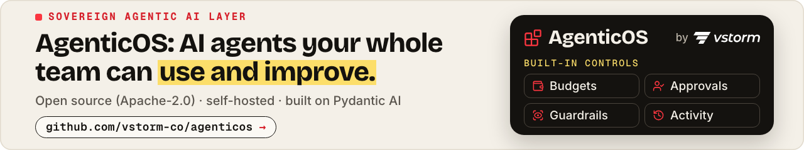
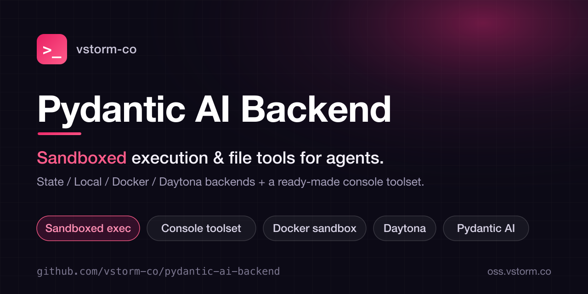
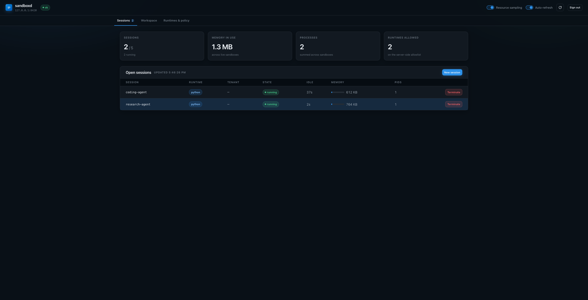
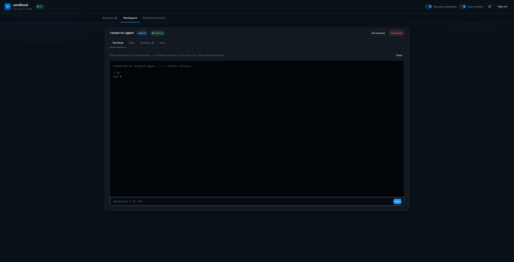
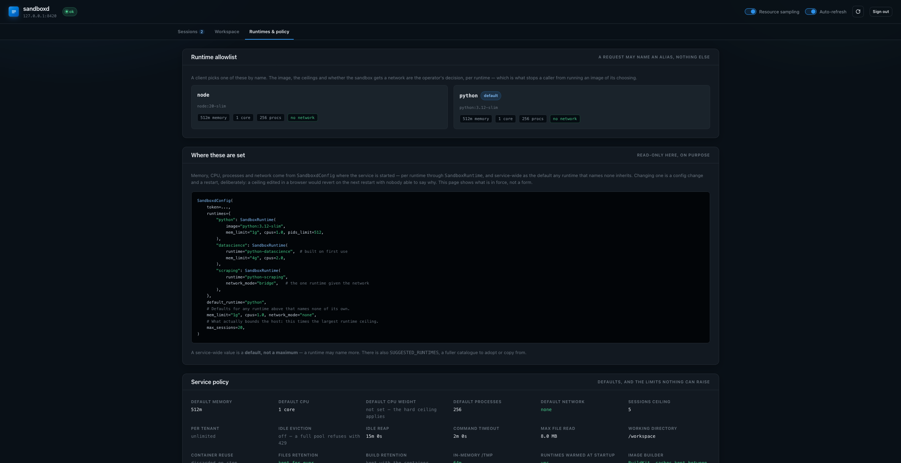

<p align="center">
  <a href="https://github.com/vstorm-co/agenticos">
    
  </a>
</p>
<p align="center"><sub>From the team behind this repo: <a href="https://github.com/vstorm-co/agenticos"><b>AgenticOS</b></a>, the Sovereign Agentic AI Layer. AI agents your whole team can use and improve: open source (Apache-2.0), self-hosted, built on Pydantic AI.</sub></p>

<p align="center">
  
</p>

<h1 align="center">Pydantic AI Backend</h1>

<p align="center">
  <b>Workspaces & console tools for Pydantic AI agents.</b><br>
  Docker / sandboxd / Kubernetes / Daytona / State workspaces and a console toolset that works in any of them,<br>
  plus a sandbox service so your app never needs Docker access.
</p>

<p align="center">
  <a href="https://vstorm-co.github.io/pydantic-ai-backend/">Docs</a> &middot;
  <a href="https://pypi.org/project/pydantic-ai-backend/">PyPI</a> &middot;
  <a href="#installation">Install</a> &middot;
  <a href="#vstorm-oss-ecosystem">Ecosystem</a> &middot;
  <a href="https://github.com/vstorm-co/pydantic-deepagents">Deep Agents</a>
</p>

<p align="center">
  <a href="https://pypi.org/project/pydantic-ai-backend/"></a>
  <a href="https://pepy.tech/projects/pydantic-ai-backend"></a>
  <a href="https://github.com/vstorm-co/pydantic-ai-backend/stargazers"></a>
  <a href="https://www.python.org/downloads/"></a>
  <a href="https://opensource.org/licenses/MIT"></a>
  <a href="https://coveralls.io/github/vstorm-co/pydantic-ai-backend?branch=main"></a>
  <a href="https://github.com/vstorm-co/pydantic-ai-backend/actions/workflows/ci.yml"></a>
  <a href="https://github.com/pydantic/pydantic-ai"></a>
</p>

<p align="center">
  <b>Pydantic AI workspaces</b> &nbsp;&bull;&nbsp; <b>Docker / sandboxd / Kubernetes / Daytona / State</b> &nbsp;&bull;&nbsp; <b>Console toolset</b> &nbsp;&bull;&nbsp; <b>Permission system</b> &nbsp;&bull;&nbsp; <b>No docker-in-docker</b>
</p>

---

> **Part of [Pydantic Deep Agents](https://github.com/vstorm-co/pydantic-deepagents)** — the open-source Claude Code alternative & Python agent framework. Use this library standalone, or get everything wired together in one `create_deep_agent()` call.

**Pydantic AI Backend** gives your [Pydantic AI](https://ai.pydantic.dev/) agent somewhere to work and the tools to work there. It supplies [Pydantic AI workspaces](https://pydantic.dev/docs/ai/core-concepts/workspace/) — a Docker container, a `sandboxd` session, a Kubernetes pod, a Daytona sandbox, a JSON document — and a console toolset that reads, writes, searches and runs code in whichever workspace the run has, under a fine-grained permission system.


## Use Cases

| What You Want to Build | How This Library Helps |
|------------------------|------------------------|
| **AI Coding Assistant** | Console tools with file ops + code execution, in any workspace |
| **Multi-User Web App** | A container per session, reached again by its ref |
| **Code Review Bot** | A read-only workspace: write and execute tools are never offered |
| **Secure Execution** | Permission system blocks dangerous operations |
| **Testing/CI** | `StateWorkspace` keeps files in memory, no container needed |
| **Containerised SaaS** | `sandboxd` owns Docker so your app container never holds the socket |

## Installation

```bash
pip install pydantic-ai-backend
```

Or with uv:

```bash
uv add pydantic-ai-backend
```

Optional extras:

```bash
# Console tools (Pydantic AI 2.52+)
pip install "pydantic-ai-backend[console]"

# Workspaces (Pydantic AI 2.52+); add the provider's own extra
pip install "pydantic-ai-backend[workspaces,docker]"      # DockerWorkspace
pip install "pydantic-ai-backend[workspaces,kubernetes]"  # KubernetesWorkspace
pip install "pydantic-ai-backend[workspaces,daytona]"     # DaytonaWorkspace
pip install "pydantic-ai-backend[workspaces]"             # SandboxdWorkspace, StateWorkspace

# The sandbox service itself (install in the service image, not your app)
pip install "pydantic-ai-backend[server]"

# Reading what sandboxd sessions left behind
pip install "pydantic-ai-backend[remote]"
```

## Quick Start

A workspace capability supplies the environment; `ConsoleCapability` gives the model tools that work in it:

```python
from pydantic_ai import Agent

from pydantic_ai_backends import ConsoleCapability, DockerWorkspace

agent = Agent(
    "anthropic:claude-opus-5-5",
    capabilities=[DockerWorkspace(runtime="python-datascience"), ConsoleCapability()],
)

first = agent.run_sync("Create a script that calculates fibonacci and run it")
# Same container: the workspace ref travels on the message history.
second = agent.run_sync("Now add tests for it", message_history=first.all_messages())
```

**That's it.** Your agent can now:

- List files and directories (`ls`)
- Read and write files (`read_file`, `write_file`)
- Edit files with string replacement (`edit_file`)
- Search with glob patterns and regex (`glob`, `grep`)
- Execute shell commands (`execute`)

The container is created on first use and kept after the run. Remove it when you are done with it: `await workspace.destroy(ref)`.

### With Permissions

```python
from pydantic_ai_backends import ConsoleCapability
from pydantic_ai_backends.permissions import READONLY_RULESET

# Read-only agent — write/edit/execute tools are hidden from the model
console = ConsoleCapability(permissions=READONLY_RULESET)
```

### On your own machine

Pydantic AI's own `LocalWorkspace` covers a directory on the host. It runs commands as you, so use it on your own code:

```python
from pydantic_ai import Agent
from pydantic_ai.capabilities import LocalWorkspace

from pydantic_ai_backends import ConsoleCapability

agent = Agent(
    "anthropic:claude-opus-5-5",
    capabilities=[LocalWorkspace("./project"), ConsoleCapability()],
)
```

## Available Workspaces

| Workspace | Environment | Commands | Use Case |
|-----------|-------------|----------|----------|
| `StateWorkspace` | A JSON document | No | Tests, files kept in your database |
| `DockerWorkspace` | A container on this host | Yes | Model-written code, one host |
| `SandboxdWorkspace` | A container behind the `sandboxd` service | Yes | Containerised apps that must not hold the Docker socket |
| `KubernetesWorkspace` | A pod, through `pods/exec` | Yes | Sandboxes scheduled by a cluster |
| `DaytonaWorkspace` | A Daytona sandbox | Yes | Hosted sandboxes |

Pydantic AI ships `LocalWorkspace`, and its harness covers E2B, Modal and Sprites; `ConsoleCapability` works in all of them. Every workspace here is created on first use, attached again by its ref, and never deleted for you. `DockerWorkspace` and `SandboxdWorkspace` pass Pydantic AI's own conformance suite against a real Docker daemon, and `StateWorkspace` passes it in CI.

[Workspaces →](https://vstorm-co.github.io/pydantic-ai-backend/concepts/workspaces/)

### State documents

```python
from pydantic_ai_backends import StateBackend, StateWorkspace

store = {"conv-42": StateBackend(files=row.files, directories=row.directories)}
workspace = StateWorkspace(store=store)
```

A `StateBackend` is a filesystem kept as a JSON document — `files`, and the `directories` created — so a host can keep a workspace in a database row and hand it back on the next turn. Binary content is held base64, so the document stays JSON even after an agent writes an image into it.

### sandboxd: no docker.sock in your app

If your application runs in a container, giving it a Docker sandbox the obvious
way means mounting `/var/run/docker.sock` — which is an unauthenticated API for
**root on the host**. Docker-in-Docker needs `--privileged` and lands in the same
place. So instead, one small service owns the socket and your app speaks HTTP to
it:

```python
from pydantic_ai import Agent

from pydantic_ai_backends import ConsoleCapability, SandboxdWorkspace

sandbox = SandboxdWorkspace(service_url="http://sandboxd:8080", token="...")
agent = Agent("anthropic:claude-opus-5-5", capabilities=[sandbox, ConsoleCapability()])
```

Nothing starts until it is used: the session — and the container behind it — opens
on the first operation, so an agent granted a sandbox it never touches costs no
container and not even a round trip. A later run with the same message history
attaches to the same session, even after the idle reaper closed it, for as long as
the service keeps its files.

The service is published as an image, and the client chooses **nothing** about
the container:

```yaml
services:
  app:
    environment: { SANDBOXD_URL: http://sandboxd:8080 }
    networks: [backend]          # no docker.sock here

  sandboxd:
    image: ghcr.io/vstorm-co/sandboxd:latest
    environment:
      SANDBOXD_TOKEN: ${SANDBOXD_TOKEN:?}
      SANDBOXD_HOST: 0.0.0.0
      SANDBOXD_WORKSPACE_ROOT: /workspaces      # files survive idle reaping
      SANDBOXD_MAX_SESSIONS_PER_TENANT: "5"     # one tenant cannot take the pool
    volumes: ["/var/run/docker.sock:/var/run/docker.sock"]
    group_add: ["${DOCKER_GID}"]  # it runs unprivileged; this reaches the socket
    networks: [backend]          # and no `ports:` either
```

Every field of `SandboxdConfig` is `SANDBOXD_` plus its name in upper case —
runtimes, ceilings, retention, the lot — so the whole policy is a compose file
and there is no launcher to write. A value that will not parse, or a combination
the service refuses, fails at startup naming the variable.

To embed it in something larger, `create_app` still takes the config directly:

```python
from pydantic_ai_backends.remote.server import SandboxdConfig, create_app

app = create_app(
    SandboxdConfig(
        token="a-long-random-secret",
        runtimes={"python": "python:3.12-slim"},  # allowlist; a request sends an alias
        mem_limit="1g",
        cpus=2.0,
        network_mode="none",  # sandboxes get no network by default
        max_sessions=20,  # beyond this: 429, not unbounded containers
        workspace_root="/workspaces",  # files survive idle reaping
    )
)
```

Three settings decide what survives an idle timeout, and they cover different
things: `workspace_root` keeps the **work directory**, `persist_containers` keeps
the container's **write layer** so `pip install` survives too, and
`workspace_ttl` **reclaims** workspaces nobody opens any more.
`await sandbox.destroy(ref)` drops a session's files for good when its
conversation is deleted.

Users can see what the agent wrote — including in a conversation from last week,
long after its sandbox was reaped. `WorkspaceArchive` reads the stored workspace
off the host volume, so **no container starts**:

```python
from pydantic_ai_backends import WorkspaceArchive

archive = WorkspaceArchive("http://sandboxd:8080", token="...")
for entry in archive.ls(ref.id):
    print(entry["path"], entry["size"])
print(archive.read(ref.id, "report.md"))
```

Proxy it from your backend rather than handing a token to the browser — the service
token can start containers.

### The operator dashboard

`SandboxdConfig(ui_enabled=True)` serves a dashboard at `/ui` — one
self-contained HTML file, no build step and no CDN, so it works offline and
behind a strict CSP. Three views:

**Sessions** — capacity at a glance, and every open session with its tenant, idle
time and memory against its own ceiling.



**Workspace** — one session at full width: a terminal with command history, the
stored workspace's files, the activity log and session info.



**Runtimes & policy** — the allowlist with each runtime's image, ceilings and
whether it gets a network, the config that produces it, and every limit in force.



Off by default: the page asks a human for the service token, and that token can
start containers on the host.

[sandboxd →](https://vstorm-co.github.io/pydantic-ai-backend/concepts/remote/)

## Console Tools

`ConsoleCapability` takes the toolset's options:

```python
from pydantic_ai_backends import ConsoleCapability

# Without shell execution
ConsoleCapability(include_execute=False)

# Leaner descriptions for an agent that is not working in a repository
ConsoleCapability(profile="agent")

# Custom tool text — a string replaces the description, a ToolText
# replaces the per-argument text with it
ConsoleCapability(descriptions={"execute": "Run shell commands in the workspace"})

# read_file on .png/.jpg/.gif/.webp returns BinaryContent multimodal models can see
ConsoleCapability(image_support=True)
```

Prefer a bare toolset? `create_console_toolset()` returns the same tools; they work in `ctx.workspace` either way.

**Available tools:** `ls`, `read_file`, `write_file`, `edit_file`, `glob`, `grep`, `execute`

## Permission System

Fine-grained access control, enforced by the tools on every call:

```python
from pydantic_ai_backends import ConsoleCapability
from pydantic_ai_backends.permissions import DEFAULT_RULESET, READONLY_RULESET

# Safe defaults (allow reads, ask for writes)
ConsoleCapability(permissions=DEFAULT_RULESET)

# Read-only mode
ConsoleCapability(permissions=READONLY_RULESET)
```

| Preset | Description |
|--------|-------------|
| `DEFAULT_RULESET` | Allow reads (except secrets), ask for writes/executes |
| `PERMISSIVE_RULESET` | Allow most operations, deny dangerous commands |
| `READONLY_RULESET` | Allow reads only, deny all writes and executes |
| `STRICT_RULESET` | Everything requires approval |

## Docker Runtimes

Pre-configured environments for `DockerWorkspace(runtime=...)`:

| Runtime | Image | What it adds |
|---|---|---|
| `python-minimal` | python:3.12-slim | standard library only |
| `python-datascience` | built on python:3.12-slim | pandas, numpy, matplotlib, scikit-learn, seaborn |
| `python-analytics` | built on python:3.12-slim | duckdb, polars, pyarrow |
| `python-web` | built on python:3.12-slim | fastapi, uvicorn, sqlalchemy, httpx |
| `python-scraping` | built on python:3.12-slim | httpx, beautifulsoup4, lxml, markdownify |
| `python-documents` | built on python:3.12-slim | pypdf, python-docx, openpyxl, pillow |
| `node-minimal` | node:20-slim | nothing |
| `node-typescript` | built on node:20-slim | typescript, tsx, vitest |
| `node-react` | built on node:20-slim | typescript, vite, react, react-dom, @types/react |
| `bun` | oven/bun:1-slim | Bun's own bundler, test runner and package manager |
| `deno` | denoland/deno:alpine | TypeScript with no install step |
| `go` | golang:1.23-alpine | Go toolchain |
| `rust` | rust:1-slim | Rust toolchain with cargo |

A runtime naming an `image` starts as fast as a pull. One naming a `base_image`
plus `packages` builds an image on first use and hits the cache afterwards, which
is worth it when installing them per session would dominate.

Custom runtime:

```python
from pydantic_ai_backends import DockerWorkspace, RuntimeConfig

runtime = RuntimeConfig(
    name="ml-env",
    base_image="python:3.12-slim",
    packages=["torch", "transformers"],
)
workspace = DockerWorkspace(runtime=runtime)
```

## Why Choose This Library?

| Feature | Description |
|---------|-------------|
| **Native Pydantic AI workspaces** | Docker, sandboxd, Kubernetes, Daytona and state documents behind `ctx.workspace` |
| **Console Toolset** | Ready-to-use tools that work in any workspace, including the harness's |
| **Permission System** | Pattern-based access control with presets |
| **Docker Isolation** | Safe execution of untrusted code |
| **No Docker-in-Docker** | `sandboxd` holds the socket; your app holds a token |
| **Commands that stop** | A timed-out or cancelled command is stopped with everything it started |
| **Image Support** | Multimodal models can see images via BinaryContent |
| **Pre-built Runtimes** | Python and Node.js environments ready to go |

## Vstorm OSS Ecosystem

This library is one piece of a broader open-source toolkit for production AI agents — all built on **[Pydantic AI](https://github.com/pydantic/pydantic-ai)**.

| Project | Description | Stars |
|---------|-------------|:-----:|
| **[Pydantic Deep Agents](https://github.com/vstorm-co/pydantic-deepagents)** | The full agent framework **and** terminal assistant — bundles every library below into one `create_deep_agent()` call. | [](https://github.com/vstorm-co/pydantic-deepagents) |
| 👉 **[pydantic-ai-backend](https://github.com/vstorm-co/pydantic-ai-backend)** | Pydantic AI workspaces — Docker / sandboxd / Kubernetes / Daytona / State — + console toolset. | [](https://github.com/vstorm-co/pydantic-ai-backend) |
| **[subagents-pydantic-ai](https://github.com/vstorm-co/subagents-pydantic-ai)** | Declarative multi-agent orchestration — sync / async / auto, with token tracking. | [](https://github.com/vstorm-co/subagents-pydantic-ai) |
| **[summarization-pydantic-ai](https://github.com/vstorm-co/summarization-pydantic-ai)** | Unlimited context for long-running agents — summarization or sliding window. | [](https://github.com/vstorm-co/summarization-pydantic-ai) |
| **[pydantic-ai-shields](https://github.com/vstorm-co/pydantic-ai-shields)** | Drop-in guardrails — cost caps, prompt-injection defense, PII & secret redaction, tool blocking. | [](https://github.com/vstorm-co/pydantic-ai-shields) |
| **[pydantic-ai-todo](https://github.com/vstorm-co/pydantic-ai-todo)** | Task planning with subtasks, dependencies, and cycle detection. | [](https://github.com/vstorm-co/pydantic-ai-todo) |
| **[full-stack-ai-agent-template](https://github.com/vstorm-co/full-stack-ai-agent-template)** | Zero to production AI app in 30 minutes — FastAPI + Next.js 15, RAG, 6 AI frameworks. | [](https://github.com/vstorm-co/full-stack-ai-agent-template) |

> **Want it all wired together?** [Pydantic Deep Agents](https://github.com/vstorm-co/pydantic-deepagents) ships every library above integrated — planning, filesystem, subagents, memory, context management, and guardrails — behind a single function call. Browse everything at [oss.vstorm.co](https://oss.vstorm.co).


## Contributing

```bash
git clone https://github.com/vstorm-co/pydantic-ai-backend.git
cd pydantic-ai-backend
make install
make test  # 100% coverage required
```

## Star History

If this library saved you from wiring an agent harness by hand — **[give it a ⭐](https://github.com/vstorm-co/pydantic-ai-backend)**. It's the single biggest thing that helps the project grow.

<p align="center">
  <a href="https://www.star-history.com/#vstorm-co/pydantic-ai-backend&type=date">
    
  </a>
</p>

---

## License

MIT — see [LICENSE](LICENSE)

---

<div align="center">

### Need help shipping AI agents in production?

<p>We're <a href="https://vstorm.co"><b>Vstorm</b></a> — an Applied Agentic AI Engineering Consultancy<br>with 30+ production agent implementations. <a href="https://github.com/vstorm-co/pydantic-deepagents"><b>Pydantic Deep Agents</b></a> is what we build them with.</p>

<a href="https://vstorm.co/contact-us/">
  
</a>

<br><br>

Made with **care** by <a href="https://vstorm.co"><b>Vstorm</b></a>

</div>
