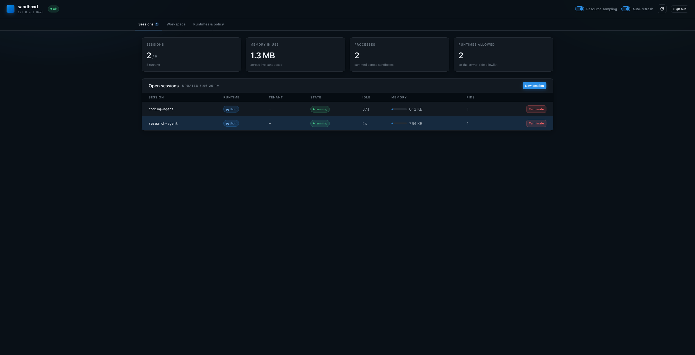

# Remote Sandboxes

`RemoteSandbox` runs your agent's sandbox in **another process**, so your
application never needs Docker access. A separate service — `sandboxd` — owns the
Docker socket and rents out sandboxes over HTTP.

```python
from pydantic_ai_backends.remote import RemoteSandbox

sandbox = RemoteSandbox("http://sandboxd:8080", token="...")
print(sandbox.execute("python -c 'print(1+1)'").output)  # "2"
sandbox.stop()
```

The session — and the container behind it — opens on the **first operation**, so
an agent granted a sandbox it never touches costs nothing.

## Why this exists

If your application runs in a container and wants a Docker sandbox, there are
only three options:

| Approach | What it costs you |
|---|---|
| Mount `/var/run/docker.sock` into the app | The socket is an unauthenticated API for **root on the host**. Anything that can reach it can start a privileged container that bind-mounts `/`. |
| Docker-in-Docker | Needs `--privileged`. Same outcome, more moving parts. |
| **`sandboxd` + `RemoteSandbox`** | The app holds only an HTTP token. One small service holds the socket. |

The third is what this module is. No docker-in-docker.

## Installation

The client needs only `httpx`; the service needs FastAPI and the Docker SDK, so
they are separate extras — install the client extra in your app image and the
server extra in the sandbox service image.

```bash
pip install pydantic-ai-backend[remote]   # RemoteSandbox (client)
pip install pydantic-ai-backend[server]   # sandboxd (service)
```

## Running the service

The shipped entrypoint configures itself from the environment, so a compose file
is all a deployment needs:

```bash
SANDBOXD_TOKEN=a-long-random-secret python -m pydantic_ai_backends.remote.server
```

Every field of [`SandboxdConfig`](../api/remote.md) is `SANDBOXD_` plus its name
in upper case — `SANDBOXD_MAX_SESSIONS`, `SANDBOXD_WORKSPACE_ROOT`,
`SANDBOXD_PERSIST_CONTAINERS`, and so on. There is no separate vocabulary to
learn and nothing to keep in step: the dataclass *is* the documentation.

Three rules cover the parsing:

| | |
|---|---|
| **Absent** | takes the shipped default |
| **Empty**, on a field that may be `None` | turns it off — `SANDBOXD_CPUS=` means no hard CPU ceiling, which absent cannot say |
| **Booleans** | `1/0`, `true/false`, `yes/no`, `on/off`, any case |

A value that will not parse, or a combination the service refuses — hibernation
without a workspace root, a default runtime no entry defines — fails at startup
with one line naming the variable, rather than at the first request.

`SANDBOXD_HOST` and `SANDBOXD_PORT` decide where it listens; they default to
`127.0.0.1:8080`, so a container needs `SANDBOXD_HOST=0.0.0.0`.

### The allowlist from the environment

`SANDBOXD_RUNTIMES` takes a compact form for what a compose file usually wants:

```bash
SANDBOXD_RUNTIMES=python=python:3.12-slim,node=node:20-slim
```

`@name` builds one of the [shipped catalogues](#shipped-catalogues) instead of
pulling an image, and `;field=value` sets that runtime's own ceilings — the
field names are `SandboxRuntime`'s:

```bash
SANDBOXD_RUNTIMES=data=@python-datascience;mem_limit=4g;cpus=3,shell=python:3.12-slim
```

A JSON object is accepted too, and is the only form that can express a runtime
whose package list is written out rather than named:

```bash
SANDBOXD_RUNTIMES='{"ml": {"runtime": {"name": "ml", "base_image": "python:3.12-slim",
                    "packages": ["torch"]}, "mem_limit": "8g"}}'
```

Unset it and the service takes its own default allowlist.

### Configuring it in Python instead

`create_app` takes a `SandboxdConfig` directly, for a service embedded in
something larger. `config_from_env` is importable on its own if you want the
environment parsed and then adjusted:

```python
# sandboxd_app.py
from pydantic_ai_backends.remote.server import SandboxdConfig, create_app

app = create_app(
    SandboxdConfig(
        token="a-long-random-secret",
        runtimes={
            "python": "python:3.12-slim",
            "node": "node:20-slim",
        },
        default_runtime="python",
        max_sessions=20,
        mem_limit="1g",
        cpus=2.0,
        network_mode="none",
        idle_timeout=1800,
        # Files and installed packages survive a reaping.
        workspace_root="/workspaces",
        persist_containers=True,
        workspace_ttl=14 * 24 * 3600,
        # One tenant cannot occupy the whole pool.
        max_sessions_per_tenant=5,
    )
)
```

```bash
uvicorn sandboxd_app:app --host 0.0.0.0 --port 8080
```

In Compose, the socket is mounted **only** into this service, and the service is
never published to the edge:

```yaml
services:
  app:
    # no docker socket here
    environment:
      SANDBOXD_URL: http://sandboxd:8080
      SANDBOXD_TOKEN: ${SANDBOXD_TOKEN}
    networks: [backend]

  sandboxd:
    image: ghcr.io/vstorm-co/sandboxd:latest
    volumes:
      - /var/run/docker.sock:/var/run/docker.sock
      - sandbox_workspaces:/workspaces
    environment:
      SANDBOXD_TOKEN: ${SANDBOXD_TOKEN:?generate a long random value}
      SANDBOXD_HOST: 0.0.0.0
      SANDBOXD_WORKSPACE_ROOT: /workspaces
      SANDBOXD_PERSIST_CONTAINERS: "true"
      SANDBOXD_MAX_SESSIONS_PER_TENANT: "5"
    networks: [backend]        # deliberately no `ports:`

volumes:
  sandbox_workspaces:
```

Pin the tag in production — `ghcr.io/vstorm-co/sandboxd:0.3` tracks patches of
one minor version, and a bare digest pins it exactly. The image is published
from this repository on every release and contains only the package and its
`server` extra.

## The runtime allowlist

A request names an **alias** and nothing else. What that alias runs — the image,
the ceilings, whether the sandbox gets a network — is the operator's decision,
per runtime:

```python
from pydantic_ai_backends.remote.server import SandboxRuntime, SandboxdConfig

SandboxdConfig(
    token=token,
    runtimes={
        # A ready-made image: starts as fast as a pull.
        "python": SandboxRuntime(image="python:3.12-slim", mem_limit="1g", cpus=1.0),
        # A built runtime: the first session installs the packages into an image,
        # later ones hit the cache. Worth it when per-session installs would
        # dominate.
        "datascience": SandboxRuntime(runtime="python-datascience", mem_limit="4g", cpus=2.0),
        # The one runtime allowed to reach the network, deliberately.
        "scraping": SandboxRuntime(runtime="python-scraping", network_mode="bridge"),
    },
    default_runtime="python",
    # Defaults for any runtime that names none of its own.
    mem_limit="1g",
    cpus=1.0,
)
```

Ceilings are per runtime because they are not one number for a whole service: a
notebook-style data runtime needs several gigabytes where a plain shell needs a
few hundred megabytes, and forcing one value on both either starves the first or
over-commits the host for the second.

A ceiling a runtime leaves unset takes the service-wide value, which is a
**default rather than a maximum** — a runtime may name more. What bounds the host
is `max_sessions` times the largest runtime ceiling, and that is the number to
size for.

`runtime=` accepts the name of any
[built-in runtime](docker.md#built-in-runtimes) or a `RuntimeConfig` of your own.
Its `work_dir` is overridden with the service's, so the workspace volume, the
archive endpoints and a client's paths cannot end up disagreeing about where
files live.

### Shipped catalogues

| Catalogue | What it is |
|---|---|
| `DEFAULT_RUNTIMES` | What you get when you name nothing: `python` and `node`, both ready-made, no ceilings of their own. A default that built package sets would make a fresh deployment's first session take minutes. |
| `SUGGESTED_RUNTIMES` | A fuller catalogue to adopt or copy from — data, analytics, documents, scraping, TypeScript, Go, Rust, each with a memory ceiling that suits it. |

```python
from pydantic_ai_backends.remote.server import SUGGESTED_RUNTIMES, SandboxdConfig

SandboxdConfig(token=token, runtimes=SUGGESTED_RUNTIMES, default_runtime="python")
```

Not the default, because every entry is a commitment on the operator's own host:
`python-datascience` builds an image on first use and is given four gigabytes, and
`python-scraping` is the one entry allowed the network. Those are decisions worth
reading before enabling.

A bare string still works wherever a runtime entry is expected —
`runtimes={"python": "python:3.12-slim"}` is `SandboxRuntime(image=...)`.

## Security model

A process that can talk to the Docker daemon is root-equivalent on the host, so
`sandboxd` is the most sensitive process in a deployment. It is built around
that:

- **Clients choose nothing about the container.** Image, mounts, network mode and
  every resource ceiling come from `SandboxdConfig`. A request carries at most a
  runtime **alias**, validated against the allowlist — so a client cannot run an
  image of its choosing.
- **Session ids are pattern-checked** before they reach a path or a container, so
  one cannot traverse a directory.
- **Each session gets its own token.** The service token is the only one that may
  open or enumerate sessions; a session token reaches only its own sandbox.
- **The token is verified before existence is revealed**, so an unauthenticated
  caller cannot enumerate session ids by watching `401` turn into `404`.
- **`network_mode` defaults to `"none"`.** A service handing sandboxes to
  untrusted code should not give them the network unless that is deliberate.
- Bind it to a private network. It has no TLS and no rate limiting of its own.

### Running sandboxes unprivileged

A container runs as root unless told otherwise, and that is two problems: an
escape starts from uid 0, and every file an agent writes into its bind-mounted
workspace is owned by root **on the host**, so a `sandboxd` running
unprivileged cannot clean up after its own sessions.

`sandbox_uid` turns that off:

```python
SandboxdConfig(
    token=token,
    workspace_root="/var/lib/sandboxd",
    sandbox_uid=1000,
)
```

Built runtimes are then built around that user — a real account for it, a home
directory, and a virtualenv it owns first on `PATH` — and their containers run
as it, with each session's workspace given to it.

The virtualenv is what makes this workable rather than merely safer. A non-root
user cannot write to the interpreter's own `site-packages`, so without one an
agent's first `pip install` fails; `uv`, which has no `--user` mode, fails with
no way forward at all. Owning a virtualenv means both simply work, and console
scripts land somewhere already on `PATH`. Measured in that shape: `whoami`,
`git commit`, `pip install`, `uv pip install` and running the installed tool all
succeed, while `/etc` and the system `site-packages` are refused.

Two things it asks of the deployment:

- **The service must be able to give each workspace to that uid.** Either run it
  with the privilege to `chown`, or run it *as* that uid so the directories are
  created owned by it. A service that can do neither is told so when the session
  opens, rather than starting a sandbox whose first file write would fail with
  an error nothing explains.
- **Ready-made runtimes stay as root.** An image nobody built for this has no
  such user and no virtualenv, so an agent inside one could install nothing. The
  uid reaches runtimes built from a `base_image` and no others.

## Sessions that outlive a run

By default, opening a session id that is already in use is a `409` — silently
sharing another caller's sandbox is the worse failure. Pass `reuse=True` when a
sandbox is meant to span several runs, such as one conversation:

```python
# First turn: creates the session.
sandbox = RemoteSandbox(url, token=token, session_id=session_id, reuse=True)
sandbox.start()
sandbox.write("/notes.md", "draft")

# Later turn, new process even: attaches to the same sandbox.
sandbox = RemoteSandbox(url, token=token, session_id=session_id, reuse=True)
sandbox.start()
assert sandbox.read_bytes("/notes.md") == b"draft"
```

A `runtime` that disagrees with the open session is **refused**, not honoured.
Honouring it would mean replacing a live sandbox and discarding the files the
caller came back for.

### Choosing what the session id keys on

The session id is the only thing you choose, so it is what decides who shares
files with whom:

| Keyed on | Who shares the sandbox | Good for |
|---|---|---|
| a run id | nobody — ephemeral | one-shot analysis |
| a conversation id | **everyone in that chat**, group chats included | a Slack channel, a web thread |
| a user id | that person across all their chats | a personal workspace |
| an agent id | **everyone who talks to that agent** | one shared machine for a team |

The last two are data-sharing decisions rather than technical ones: with an
agent-keyed sandbox, any user reads what any other user wrote. Make that visible
wherever the choice is made.

Keep ids unguessable — derive them from a UUID you generated, never from a
sequential id or user input — and inside 64 characters.

## Making it fast on a small host

Four settings, and on a 4 GB box each one is worth more than it sounds.

```python
SandboxdConfig(
    token=token,
    runtimes=SUGGESTED_RUNTIMES,
    prewarm=True,  # build and pull the allowlist at startup, not on a request
    persist_containers=True,  # a woken session restarts instead of rebuilding
    tmpfs_size="64m",  # scratch writes stay in RAM, off the overlay
    cpu_shares=1024,  # weight rather than a hard cap, so idle cores get used
    cpus=None,
)
```

None of them moves the ceiling as far as separating resident sessions from open
ones does — see [A working set, not a hard cap](#a-working-set-not-a-hard-cap),
which is where the order-of-magnitude is. These four are what make each resident
session cheap once that split is in place.

**`prewarm`** pulls and builds the whole allowlist in the background as the
service starts, sequentially so several builds do not fight over one small host.
Without it the first session on a built runtime pays for the image — measured at
about eleven seconds for a pandas runtime — in the middle of somebody's request.
A runtime that will not build is logged and skipped; one bad entry does not stop
the others being ready.

**`tmpfs_size`** gives every sandbox an in-memory `/tmp`. Otherwise scratch files
land in the container's write layer, which is slower and grows the disk. The
mount is given `exec` explicitly, because Docker's default is `noexec` and that
breaks installing any package that builds from source.

Its pages are charged to the container's own memory cgroup, so it comes *out of*
`mem_limit` rather than being extra: a sandbox limited to 512m with a 64m `/tmp`
has 448m left for its processes, and one that tries to exceed the limit through
`/tmp` is killed by its own cgroup rather than troubling the host. Keep it small
when many sessions are open at once.

**`cpu_shares` versus `cpus`.** A hard `cpus=1.0` means a sandbox never exceeds
one core — including when the other three are idle, which on a small VPS is
usually the wrong trade. A weight only applies under contention: one active
sandbox may use the whole machine, and several are still divided fairly. Set
both if you want a ceiling *and* fair sharing.

**Builds use BuildKit when the `docker` CLI is present**, which is what lets a
package cache survive between builds — editing one package in a runtime then
re-downloads nothing. The Python SDK has no BuildKit support at all and its
builder rejects cache mounts outright, so without the CLI the generated
Dockerfile falls back to discarding the cache instead. `GET /policy` reports
which builder is in force, so it is never a mystery.

Images superseded by a build are removed as it finishes. The tag embeds a digest
of the runtime, so every edit mints a new one and would otherwise leave a few
hundred megabytes behind for good — an image still backing a running container is
left alone.

### What the host is worth, before any of the above

Three changes outside this library, in descending order of megabytes recovered.
None of them needs a code change here.

**`crun` as the daemon's default runtime.** `runc` is Go, with a garbage
collector and a supervising process per container; `crun` is the same interface
in C. Reported at roughly twice the container-lifecycle speed and 30–40% less
per-container overhead, which at a hundred sessions is a gigabyte the sandboxes
get instead:

```json
{ "default-runtime": "crun", "runtimes": { "crun": { "path": "/usr/bin/crun" } } }
```

This is a different question from `oci_runtime`, which selects an *isolation
model* per runtime alias. `crun` is a faster `runc`, not a different boundary, so
it belongs in the daemon's own config where it applies to everything.

**`zram`, and then `memswap_limit`.** A sandbox is denied swap by default —
`memswap_limit` is pinned to `mem_limit` — because a container swapping to a disk
starves every other one on the host. That reasoning does not hold when swap is
`zram`: the pages stay in RAM compressed, idle Python heaps at roughly 3:1, and
the alternative to a little swapping is an OOM kill mid-command. On a host with
`zram` configured, and only there:

```python
SandboxdConfig(token=token, mem_limit="384m", memswap_limit="512m")
```

**One base image across the allowlist.** Read-only pages are shared between
containers only when the layer is literally the same file. Runtimes built from
one `python:3.12-slim` share the interpreter and the standard library; runtimes
built from different bases share nothing. `SUGGESTED_RUNTIMES` is arranged this
way — every Python entry on `python:3.12-slim`, every Node one on `node:20-slim`
— and a custom allowlist is worth checking against the same rule. It is also the
reason containers beat microVMs badly on a small host: a microVM caches those
pages once per guest, so a hundred of them hold a hundred copies.

### The library matters more than the tuning

Measured on one 188 MB CSV, the same `GROUP BY` in each:

| Library | Import | Time | Peak RSS | Under a 384 MB ceiling |
|---|---|---|---|---|
| pandas | 97 MB | 1.7 s | 570 MB | **killed, exit 137** |
| Polars | 43 MB | 0.2 s | 502 MB | survives, 0.7 s |
| DuckDB | 51 MB | 0.2 s | **312 MB** | survives, 0.6 s |

pandas materialises the whole frame and copies freely, so it needs roughly three
times the file in memory. DuckDB and Polars stream, so the same answer fits in a
sandbox that pandas cannot run in at all — and they are about eight times faster
into the bargain.

That single swap does more for how many sessions fit than every container setting
on this page combined: sizing an analysis sandbox for DuckDB rather than pandas
roughly doubles how many run at once on a fixed amount of RAM. It is also the
difference between a readable error and a silent one — DuckDB raises an
`OutOfMemoryException` the agent can read and retry around, where pandas gets
`SIGKILL` and the tool call just reports exit 137.

Hence `python-analytics` in [the catalogue](docker.md#built-in-runtimes) carries a
1 GB ceiling while `python-datascience` carries 4 GB: the second number is pandas'
appetite, not the task's. Keep pandas available — most model-written code reaches
for it first — but point agents that work on real files at the columnar runtime.

## What survives, and for how long

Three settings, and they cover different things. Getting one wrong looks like the
agent forgetting its work:

| Setting | Preserves | Without it |
|---|---|---|
| `workspace_root` | the **work directory**, on a host volume per session | files vanish when the container is reaped |
| `persist_containers` | the container's **write layer** — packages installed with `pip` or `apt` | the agent reinstalls its dependencies after every idle timeout |
| `workspace_ttl` | nothing — it **reclaims** unused workspaces | workspaces accumulate on disk for ever |

Retention pulls the three apart, and the defaults say what an agent's user
expects: **files are kept for ever, builds are reclaimable.**

```python
SandboxdConfig(
    workspace_root="/var/lib/sandboxd",
    persist_containers=True,
    workspace_ttl=None,  # the default: the agent's files are the work
    container_ttl=30 * 86400,  # its installs are rebuildable, so reclaim them
)
```

`container_ttl` removes a *stopped* sandbox container that has been stopped for
that long, keeping its workspace untouched — the disk equivalent of deleting a
build directory and keeping the source. What a session installed inside itself can
be installed again; what it wrote to `/workspace` cannot. `workspace_ttl` is the
opposite knob and deletes the files, so it stays `None` unless a retention policy
says otherwise.

`workspace_root` alone is the trap: `/workspace` comes back but
`pip install pandas` does not, because it landed outside the volume. If a session
is meant to feel like "the same machine", set both.

`persist_containers` names each container after its session, so a reaped session
is *stopped* rather than discarded and the next attach restarts it. The cost is
that stopped containers stay on the host until the session is purged — which is
why it is off by default.

### Ending a session for good

```python
sandbox.stop()  # ends the turn, keeps the files for the next one
sandbox.stop(purge=True)  # discards the container and the workspace
```

Purge when the thing the session belonged to is gone — a deleted conversation, a
user who left. `workspace_ttl` is the safety net for everything nobody
remembered to purge: a workspace with no open session, untouched for longer than
the TTL, is swept. The clock runs from when the session was last *opened*, so an
active session is never swept however old its directory is.

## A working set, not a hard cap

`max_sessions` counts **live sandboxes**, and by default a full pool refuses the
next request with `429`. That is the wrong answer when the pool is full of
sessions nobody is using: an agent is turned away while a hundred containers sit
idle holding slots.

`evict_idle_after` changes that. At the ceiling, the least recently used session
idle for at least that long is **hibernated** to make room:

```python
SandboxdConfig(
    token=token,
    max_sessions=10,  # resident sandboxes — what the RAM has to hold
    max_open_sessions=200,  # sessions that exist — what the disk has to hold
    evict_idle_after=120,  # idle two minutes? your slot can be reused
    workspace_root="/var/lib/sandboxd",
    persist_containers=True,
)
```

Hibernating is not closing. The container, the process supervising it and the
memory both hold are given up; the session's token, its runtime, its event log
and its files stay. Its next request wakes it, finds its work, and pays a
container start — measured at 0.09 s for a persisted one. Nothing the client
holds stops being valid, so it never has to learn that any of this happened.

That splits one number into two, which is the point:

- **`max_sessions`** bounds *resident* sandboxes. This is the RAM number: it
  times the largest runtime ceiling is the worst case the host must survive.
- **`max_open_sessions`** bounds sessions that *exist*, resident and hibernated
  together. This is the disk number, and it is properly much larger. At the
  ceiling the session that has been asleep longest is closed for good; with every
  open session resident, the caller gets `429`.

On a small host that gap is the whole design. Ten resident sessions at 384 MB is
a machine that fits in 4 GB; two hundred open ones is what it can advertise.

A hibernated session shows in `GET /sessions` with `state: "hibernated"` and
`alive: false`, and as **asleep** in the dashboard. `idle_timeout` still ends it:
a session asleep longer than that is closed on the next sweep, since one nobody
came back to is one nobody is coming back to.

Two deliberate limits on it:

- **A busy session is never evicted.** Only sessions idle for at least
  `evict_idle_after` are candidates, because killing an agent's work to serve
  somebody else's first request is worse than making them wait. With every
  session genuinely busy the caller still gets `429` — backpressure is the honest
  answer there, not an unbounded queue. Waking is subject to the same rule: a
  hibernated session whose slot cannot be freed is answered `429` rather than
  taking one from somebody working.
- **It requires `workspace_root`.** Hibernating a session whose files live only
  in its container would discard them silently, so the configuration refuses
  rather than making that trade quietly.
- **What does not survive is process state.** A hibernated session's background
  processes — a dev server left running through the console toolset — are stopped
  with the container. Files survive; a long-lived process does not.

`max_sessions=None` removes the ceiling entirely, for hosts where something else
does the bounding.

## Capacity per tenant

`max_sessions` caps the service. That is not enough when one application serves
many tenants: the busiest one fills the pool and everybody else gets `429`.

```python
sandbox = RemoteSandbox(url, token=token, session_id=session_id, tenant=str(org_id))
```

With `max_sessions_per_tenant` set, a tenant at its own ceiling is refused while
others are still served. The label is **capacity only** — it grants nothing and
authorizes nothing, and only a holder of the service token can open a session at
all. It is reported back in `GET /sessions` and `GET /policy` so an operator can
see who is holding what.

## Nothing starts until it is used

Constructing a `RemoteSandbox` performs no I/O. The session is opened by the
first operation, which means a container starts only when the model actually
reaches for a file or a command:

```python
sandbox = RemoteSandbox(url, token=token, session_id=session_id)  # no HTTP yet
agent = Agent("openai:gpt-4.1", capabilities=[ConsoleCapability(backend=sandbox)])

result = agent.run_sync("What is 2 + 2?")  # answered without any container
result = agent.run_sync("Write hello.py")  # this is what opens one
```

That matters most for an agent that *may* need a sandbox: granting the capability
no longer costs a container per run. Call `start()` yourself only to pre-warm one
before a latency-sensitive turn.

Opening is guarded, so two operations arriving at once on a thread pool open one
session rather than racing each other into a `409`. A failure to open degrades
like any other operation failure — the tool call reports an error, the run
continues.

## Browsing files without a sandbox

A workspace outlives the sandbox that wrote it, so listing and reading it should
not cost a container start. Opening a conversation from last week just to see what
the agent produced would otherwise boot a container, wait for it, and reap it
minutes later.

`/workspaces/{session_id}/ls` and `/workspaces/{session_id}/read` serve the host
volume directly. They work for a session reaped long ago, and there is a typed
client for them:

```python
from pydantic_ai_backends.remote import WorkspaceArchive

archive = WorkspaceArchive("http://sandboxd:8080", token=service_token)
for entry in archive.ls(session_id):
    print(entry["path"], entry["size"])
print(archive.read(session_id, "report.md"))
```

Four things to know:

- **Requires `workspace_root`.** Without it there is nothing stored to read, and
  the endpoints answer `409` naming the setting rather than pretending the
  workspace is empty.
- **Service token only.** A reaped session has no token of its own left, and the
  intended caller is an application proxying file views to its users *after*
  applying its own authorization.
- **It raises rather than degrading**, unlike `RemoteSandbox`. No model is waiting
  on it, and an application answering "show me my files" needs to tell "there are
  none" apart from "the service is misconfigured".
  `WorkspaceArchiveError.status_code` carries what the service said.
- **Only the work directory is stored.** A file the agent wrote to `/tmp` is not
  in the volume and so not in the archive.

Paths are interpreted relative to the sandbox's work directory, and an absolute
in-container path works too — so a UI can hand back exactly the path a live
listing showed it.

### Why this is the most careful code in the module

These endpoints read the host filesystem, so path containment is the only thing
between a caller and the rest of the machine. Two ways in are closed, both by
resolving first and checking after:

- `..` in a requested path.
- **A symlink the sandbox itself planted.** Untrusted code in a container can run
  `ln -s /etc/shadow notes.txt`. Inside the container that points at the
  container's own file; read from the host side it would resolve to the host's. So
  a path that resolves outside the workspace is refused even when the link sits
  inside it, and such an entry is omitted from a listing rather than reported.

### Never hand a session token to a browser

Worth stating separately, because the fix is not obvious: the **session** token
authorizes `/exec` as well as `/ls` and `/read`. Putting one in a web page gives
whoever opens DevTools a shell inside the sandbox. The service token is worse.

Proxy instead — your backend holds the token, checks that this user may see this
conversation, and forwards only listing and reading.

## Failure behaviour

File and command operations **degrade rather than raise**: a transport failure
surfaces the same way a missing file does — `b""`, `[]`, or an `Error: ...`
string — matching `LocalBackend` and `DockerSandbox`. A tool call must not take
down an agent run because a socket blipped.

`start()` is the exception and does raise: a caller who cannot get a sandbox at
all needs to know why.

## Capacity and reaping

- `max_sessions` caps *resident* sandboxes; beyond it, opening a session either
  hibernates an idle one or answers `429` rather than starting unbounded
  containers. `max_open_sessions` caps how many sessions exist at all, resident
  and hibernated together. `max_sessions_per_tenant` applies a ceiling per
  `tenant` label.
- `idle_timeout` reaps sessions that have gone quiet, and the reaping is visible
  to the service's own bookkeeping — a reaped session's token and event log are
  released with it. It applies to hibernated sessions too, which the sweep ends
  once they have been asleep that long.
- `execute_timeout` clamps every command, so one client cannot occupy a worker
  indefinitely.
- `workspace_ttl` sweeps workspaces no session has opened for that long, on the
  same interval as idle reaping.
- Resource sampling is cached for a few seconds and taken concurrently off the
  event loop. One Docker stats call costs over a second — it waits for a second
  sample to compute a CPU rate — so a listing that sampled each sandbox in turn
  would take a second per session and hold up everything else meanwhile.
- Blocking sandbox calls run on the service's own thread pool (`max_workers`),
  kept separate from asyncio's shared default one because sandbox commands are
  long.

## Observability

| Endpoint | Auth | What it gives you |
|---|---|---|
| `GET /` | none | What the service is, and its mounted endpoints |
| `GET /healthz` | none | Liveness, session count, capacity |
| `GET /policy` | service token | The ceilings and image allowlist actually in force |
| `GET /sessions` | service token | Every open session; `?usage=true` also samples memory and CPU |
| `GET /sessions/{id}` | session or service token | One session, without reviving a dead sandbox |
| `GET /sessions/{id}/events?after=<seq>` | session or service token | The session's operation log, for incremental polling |

The activity log records what each operation addressed, whether it succeeded and
how long it took — never file contents or command output, which would turn an
audit trail into a data leak that also grows without bound. It is a bounded ring
buffer per session.

### Dashboard

`SandboxdConfig(ui_enabled=True)` serves a dashboard at `/ui`: one
self-contained HTML file, no build step and no CDN, so it works offline and
behind a strict CSP. Three views:

**Sessions** — capacity at a glance, and every open session with its tenant, idle
time and memory against its own ceiling. Clicking a row opens its workspace; a
session can be created here with a runtime, an id and a tenant.



**Workspace** — one session at full width: a **Terminal** with command history, a
**Files** browser, the **Activity** log and **Info**.


**Runtimes & policy** — the allowlist as cards (image, description, memory, CPU,
processes, network, and whether the first session builds an image), the
`SandboxdConfig` that produces it, and every service default and retention
setting in force.


The Files browser reads the **live sandbox** by default and can switch to the
**stored workspace**, which is served from the host volume. That distinction is
worth knowing: reading a stopped session live restarts its container, while the
stored workspace needs no container at all — and shows only the work directory.

Off by default: the page asks a human for the **service** token, and that token
can start containers on the host. Keep it on localhost or a private network.

## Using it with an agent

`RemoteSandbox` implements the same synchronous surface as `DockerSandbox`, so it
drops into a console toolset or `SessionManager` unchanged:

```python
from pydantic_ai import Agent
from pydantic_ai_backends import ConsoleCapability
from pydantic_ai_backends.remote import RemoteSandbox

sandbox = RemoteSandbox("http://sandboxd:8080", token=token, session_id=session_id)
sandbox.start()

agent = Agent(
    "openai:gpt-4.1",
    capabilities=[ConsoleCapability(backend=sandbox)],
)
```

Passing the sandbox to the capability keeps it out of your deps type — see
[Capability](capability.md#a-capability-owned-backend).
